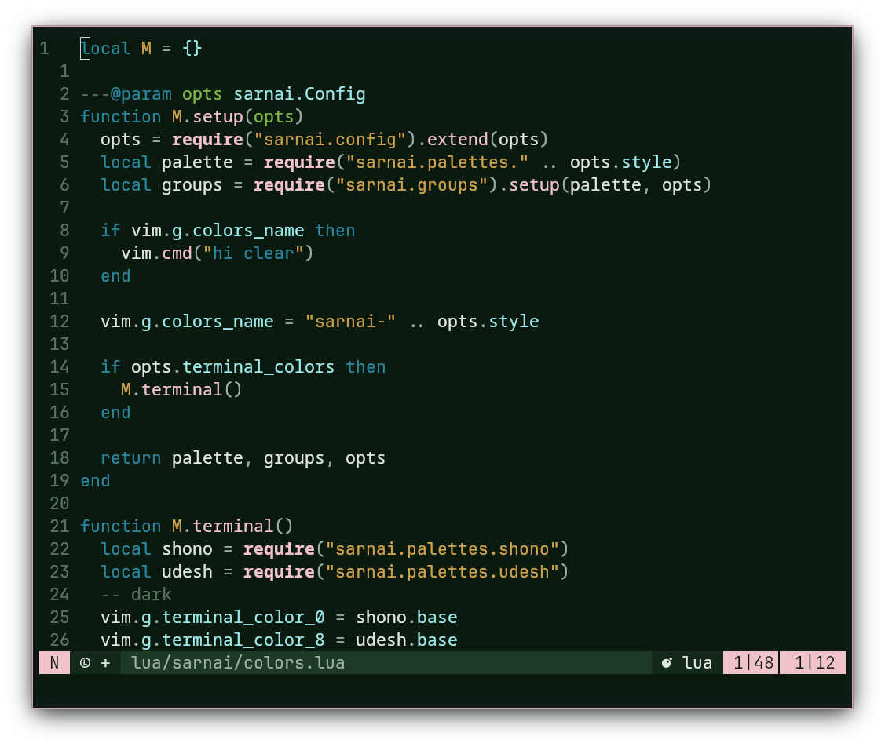
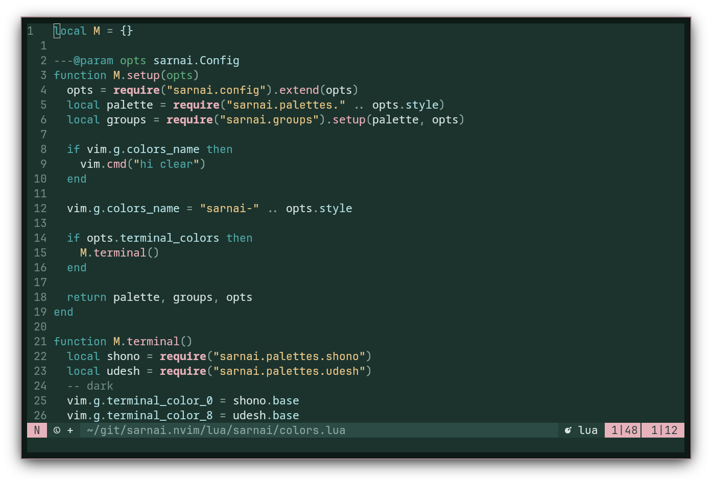
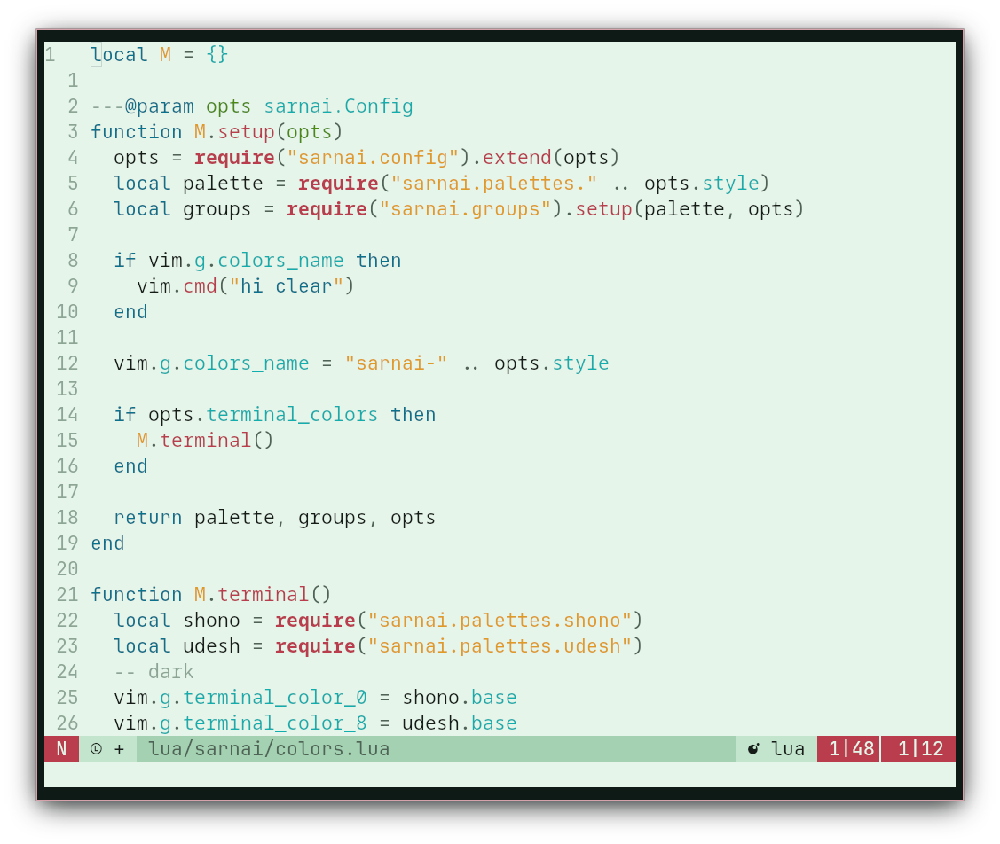

<h3 align="center">sarnai.nvim</h3>
<h6 align="center">ᠰᠠᠷᠠᠨᠠᠢ</h6>
<br/>
<p align="center">
  <a href="https://github.com/titembaatar/sarnai.nvim"></a>
  <a href="https://github.com/titembaatar/sarnai/blob/main/LICENSE"></a>
</p>

> **This is the Neovim colorscheme repository for `sarnai`.**  
> The theme repository (including palettes, integrations, etc...) is at:  
> 👉 **[titembaatar/sarnai](https://github.com/titembaatar/sarnai)**  

## Features
- Three styles:  
  - 🌌 `shono` (dark)  
  - 🌄 `udesh` (brighter dark)  
  - 🌅 `olgoo` (light)  
- WCAG contrast-compliant
- LSP & Treesitter support 
- Integrations:
  - [telescope.mvim](https://github.com/nvim-telescope/telescope.nvim)
  - [blink.cmp](https://github.com/Saghen/blink.cmp)
  - [oil.nvim](https://github.com/stevearc/oil.nvim)
  - [mini.statusline](https://github.com/echasnovski/mini.nvim)
  - [lazgit.nvim](https://github.com/kdheepak/lazygit.nvim)

## 📦 Installation

### **lazy.nvim**
```lua
return {
  "titembaatar/sarnai.nvim",
  lazy = false,
  priority = 1000,
  config = function()
    vim.cmd([[colorscheme sarnai]])
  end
}
```

## Gallery
<h4 align="center">🌌 Шөнө (Shono) - Night</h4>
<p align="center">
  
</p>
<h4 align="center">🌄 Үдэш (Udesh) - Evening</h4>
<p align="center">
  
</p>
<h4 align="center">🌅 Өглөө (Ogloo) - Morning</h4>
<p align="center">
  
</p>

## Configuration

You can customize `sarnai.nvim` using the `setup()` function.

### **Default Settings**
```lua
require("sarnai").setup({
  style = "shono",                  -- Variant: "shono", "udesh", or "ogloo"
  transparent = false,              -- Enable transparent background
  terminal_colors = true,           -- Enable terminal colors
  styles = {                        -- Enable styles for highlights
    italic = true,
    bold = true,
    underline = true,
  },
  highlights = {
    -- Comment = { fg = "nuur" }    -- Exemple of highlight override
  },
})
```

## 🫱🏼‍🫲🏽 Contributing
PRs are welcome! If you'd like to help:
1. Fork the repository
2. Make changes and test
3. Open a pull request
Feel free to report any issues, suggest features, or submit fixes. Especially for `Olgoo`, I am not quite sure if I hit the mark with the colors.
