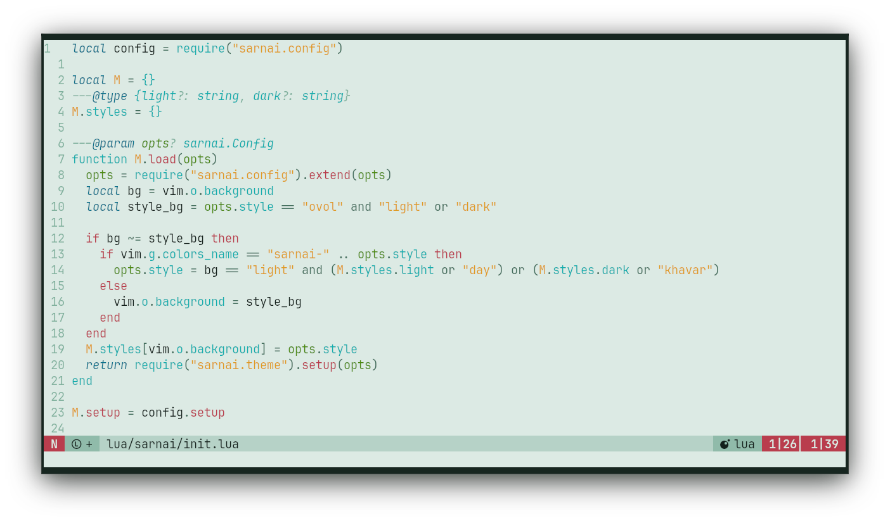

<h3 align="center">sarnai.nvim</h3>
<h6 align="center">ᠰᠠᠷᠠᠨᠠᠢ</h6>
<br/>
<p align="center">
  <a href="https://github.com/titembaatar/sarnai.nvim"></a>
  <a href="https://github.com/titembaatar/sarnai/blob/main/LICENSE"></a>
</p>

> **This is the Neovim colorscheme repository for `sarnai`.**  
> The theme repository (including palettes, integrations, etc...) is at:  
> 👉 **[titembaatar/sarnai](https://github.com/titembaatar/sarnai)**  

## Features
- Two styles:  
  - 🌸 `khavar` (dark)  
  - ❄️ `ovol` (light)  
- LSP & Treesitter support 
- Some plugins integrations

## 📦 Installation

### **lazy.nvim**
```lua
return {
  "titembaatar/sarnai.nvim",
  lazy = false,
  priority = 1000,
  opts = {},
}
```

## Gallery
<h4 align="center">🌸 Хавар (Khavar) - Spring</h4>
<p align="center">
  
</p>
<h4 align="center">❄️ Өвөл (Ovol) - Winter</h4>
<p align="center">
  
</p>

## Configuration

You can customize `sarnai.nvim` using the `opts` field.

### **Default Settings**
```lua
M.defaults = {
	style = "khavar",
	light_style = "ovol",
	transparent = false,
	terminal_colors = true,
	styles = {
		comments = { italic = true },
		keywords = { italic = true },
		functions = {},
		variables = {},
		sidebars = "dark",
		floats = "dark", 
	},
	day_brightness = 0.3,
	dim_inactive = false,
	lualine_bold = false,

	--- You can override specific color groups to use other groups or a hex color
	--- function will be called with a ColorScheme table
	---@param colors ColorScheme
	on_colors = function(colors) end,

	--- You can override specific highlights to use other groups or a hex color
	--- function will be called with a Highlights and ColorScheme table
	---@param highlights sarnai.Highlights
	---@param colors ColorScheme
	on_highlights = function(highlights, colors) end,

	cache = true,

	---@type table<string, boolean|{enabled:boolean}>
	plugins = {
		all = package.loaded.lazy == nil,
		auto = true,
	},
}
```

## 🫱🏼‍🫲🏽 Contributing
PRs are welcome! If you'd like to help:
1. Fork the repository
2. Make changes and test
3. Open a pull request
Feel free to report any issues, suggest features, or submit fixes. Especially for `Ovol`, I am not quite sure if I hit the mark with the colors.
