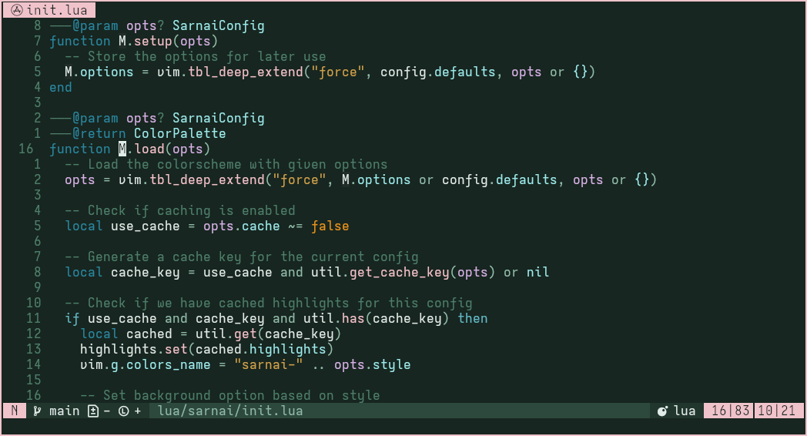

<h3 align="center">sarnai.nvim</h3>
<h6 align="center">ᠰᠠᠷᠠᠨᠠᠢ</h6>
<br/>
<p align="center">
  <a href="https://github.com/titembaatar/sarnai.nvim"></a>
  <a href="https://github.com/titembaatar/sarnai/blob/main/LICENSE"></a>
</p>

> **This is the Neovim colorscheme repository for `sarnai`.**
> The theme repository (including palettes, integrations, etc...) is at:
> 👉 **[titembaatar/sarnai](https://github.com/titembaatar/sarnai)**

## ✨ Features

- Two variants: 🌸 **Khavar** (dark) and ❄️  **Ovol** (light)
- Aim to reduce eye strain
- Treesitter integration
- Plugin ecosystem compatibility
- Customizable
- Caching for improved performance

## 📥 Installation

### Using [lazy.nvim](https://github.com/folke/lazy.nvim)

```lua
{
  "titembaatar/sarnai.nvim",
  lazy = false,
  priority = 1000,
  opts = {
    -- your configuration comes here
    -- leave it empty to use the default settings
    style = "khavar", -- khavar or ovol
    transparent = false, -- true enables transparent background
  },
}
```

## 📸 Screenshots

### Khavar (Dark Theme)


### Ovol (Light Theme)


## 🎨 Usage

After installation, you can set the colorscheme using:

```lua
-- In your init.lua
vim.cmd.colorscheme("sarnai")       -- Default (khavar/dark)
-- or
vim.cmd.colorscheme("sarnai-khavar") -- Explicitly dark theme
-- or
vim.cmd.colorscheme("sarnai-ovol")   -- Light theme
```

## ⚙️ Configuration

Sarnai.nvim comes with these defaults:

```lua
require("sarnai").setup({
  -- The theme style: "khavar" (dark) or "ovol" (light)
  style = "khavar",

  -- Enable transparent background
  transparent = false,

  -- Set terminal colors
  terminal_colors = true,

  -- Configure syntax highlighting styles
  styles = {
    -- Set to false to disable a style globally
    italic = true,
    bold = true,
    underline = true,

    -- Specific syntax elements
    comments = { italic = true },
    keywords = { italic = true },
    functions = {},
    variables = {},
  },

  -- Plugin integrations
  plugins = {
    -- Enable all plugins by default (when not using lazy.nvim)
    all = true,

    -- Auto-detect plugins via lazy.nvim
    auto = true,

    -- Override specific plugins
    -- mini = true,
    -- trouble = true,
  },

  -- Enable caching for better performance
  cache = true,

  -- Override colors
  on_colors = function(colors)
    -- Example: Customize the pink accent
    -- colors.palette.sarnai = "#e5a3ab"
  end,

  -- Override highlights
  on_highlights = function(highlights, colors)
    -- Example: Custom comment styling
    -- highlights.Comment = { fg = colors.palette.muted, italic = true }
  end,
})
```

## 🌟 Supported Plugins

Sarnai.nvim provides highlighting for:

- [fzf-lua](https://github.com/ibhagwan/fzf-lua) (fuzzy finder)
- [telescope.nvim](https://github.com/nvim-telescope/telescope.nvim) (fuzzy finder)
- [mini.nvim](https://github.com/echasnovski/mini.nvim) (statusline, files, comments, etc.)
- [blink.cmp](https://github.com/saghen/blink.cmp) (completion)
- [gitsigns.nvim](https://github.com/lewis6991/gitsigns.nvim) (git integration)
- [which-key.nvim](https://github.com/folke/which-key.nvim) (keybindings)
- [snacks.nvim](https://github.com/folke/snacks.nvim) (dashboard, notifications)
- [zen-mode.nvim](https://github.com/folke/zen-mode.nvim) (focus mode)
- [trouble.nvim](https://github.com/folke/trouble.nvim) (diagnostics viewer)
- [nvim-dap](https://github.com/mfussenegger/nvim-dap) (debugging)

## 🤝 Contributing

Contributions are welcome! Feel free to report issues, suggest features, or submit pull requests.

## 📜 License

MIT License
